# Trekkr 🌍
A social travel sharing app where users can post travel experiences, explore global destinations, and interact through likes and AI-assisted travel insights.

## Features
- Share travel experiences with images and descriptions
- Location tagging for each post
- Like system with real-time Firebase updates
- User profiles with username + profile image
- AI “Ask about this place” feature (context-aware travel suggestions)
- Full-screen post viewing experience
- Categories & mood tags (Relaxing, Cultural, Nightlife, etc.)
- Dynamic feed powered by Firebase Realtime Database
- Delete posts with image + database sync

## Tech Stack
- Android (Java)
- Firebase Realtime Database
- Firebase Storage
- Glide (image loading)
- XML (UI design)

## Setup Instructions
### 1. Clone the repository
git clone https://github.com/your-username/trekkr.git

### 2. Open in Android Studio
- Open the project folder
- Allow Gradle sync to complete

### 3. Firebase Setup
- Create a Firebase project
- Enable:
  - Realtime Database
  - Firebase Storage
- Download `google-services.json`
- Place it inside `/app` directory

### 4. Enable Permissions
Ensure the following is in `AndroidManifest.xml`:
- Internet access:
<uses-permission android:name="android.permission.INTERNET"/>
- For images/network stability:
android:usesCleartextTraffic="true"

## Firebase Structure

places/
  - placeId
    - userId
    - userName
    - userProfileImage
    - title
    - description
    - imageUrl
    - locationTag
    - category
    - mood
    - likesCount
    - timestamp

## Demo Data
Import "places_sample.json" into Data section of Realtime Database
The app includes preloaded sample travel posts featuring:
- Global destinations (Paris, Tokyo, Bali, Dubai, etc.)
- User profiles with avatars
- Realistic travel descriptions
- Categorised moods and tags

## Requirements

- Stable internet connection required for image loading
- Firebase project must be configured correctly
- Emulator or physical Android device (API 24+ recommended)

## Future Improvements
- Google Maps integration for live location pins
- Comments system under posts
- Follow/unfollow users
- Push notifications
- Dark mode support

## Screenshots

### 1. Authentication Flow
Login and signup screens for user access.

  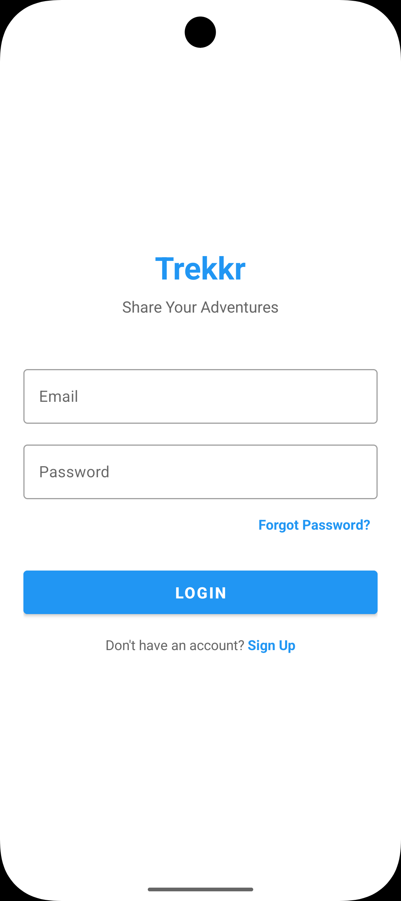
  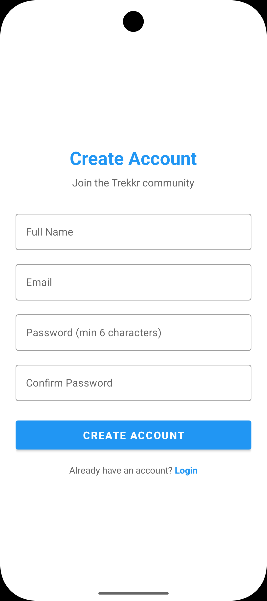

---

### 2. Home Screen
Main feed showing travel posts and user content.

  
  

---

### 3. Create Post Flow
Step-by-step process for creating a travel post.

  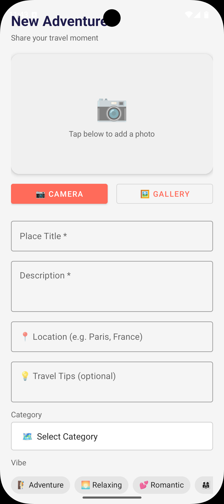
  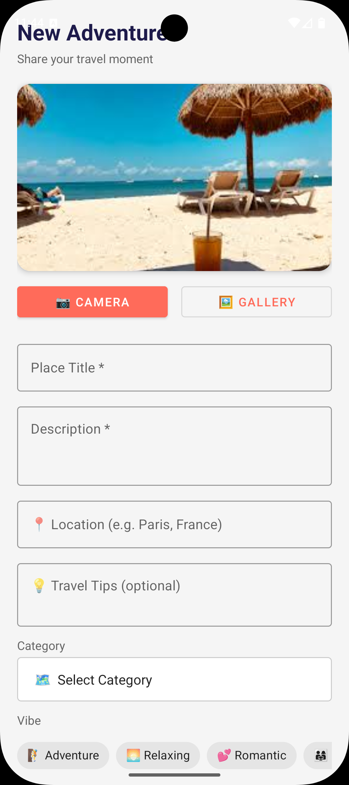
  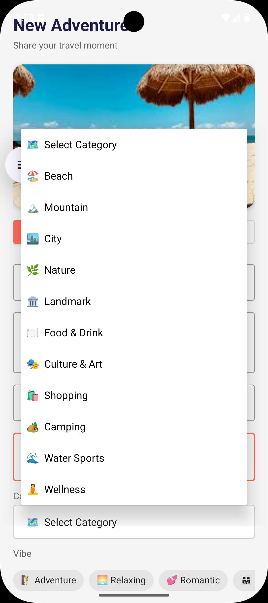

  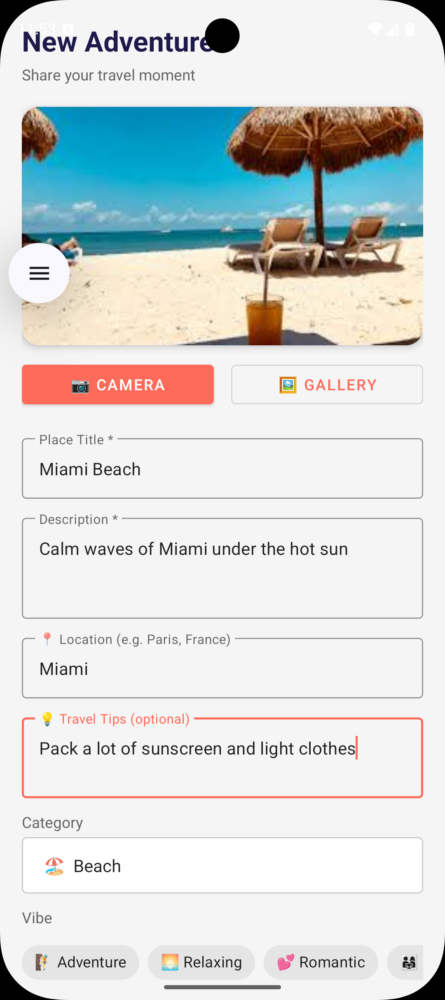
  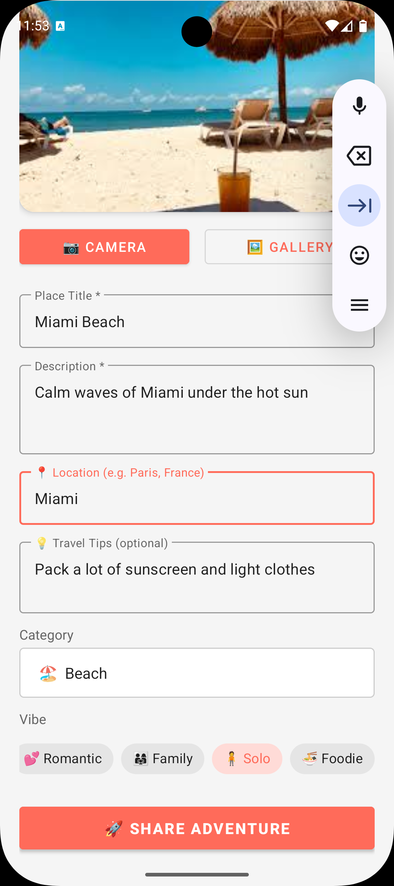
  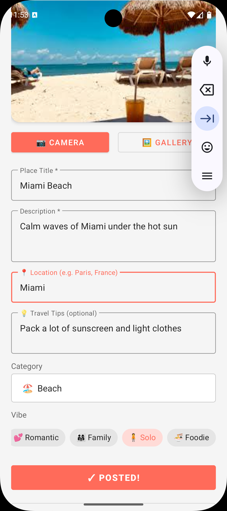

---

### 4. Post AI Assistant
Ask AI about a specific post and receive contextual travel insights.

  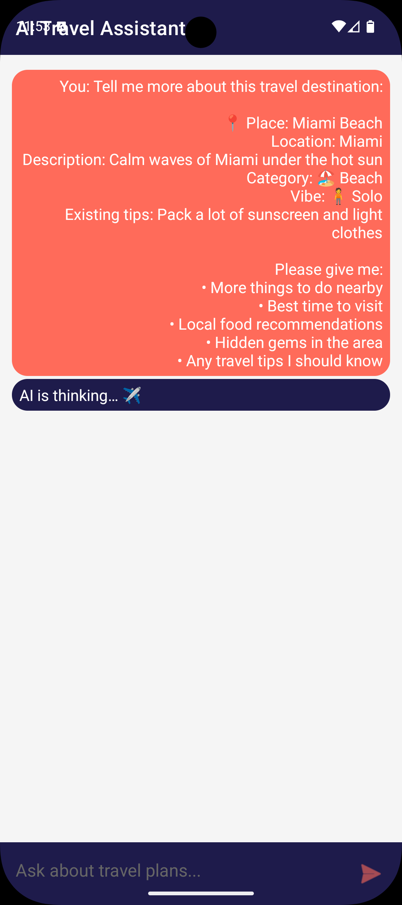
  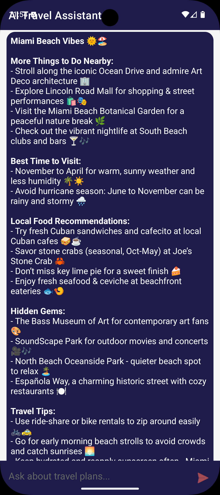
  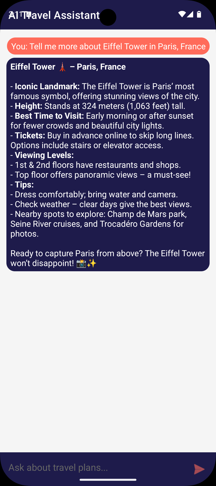

---

### 5. AI Follow-Up Interaction
Users can continue the AI conversation with follow-up questions.

  
  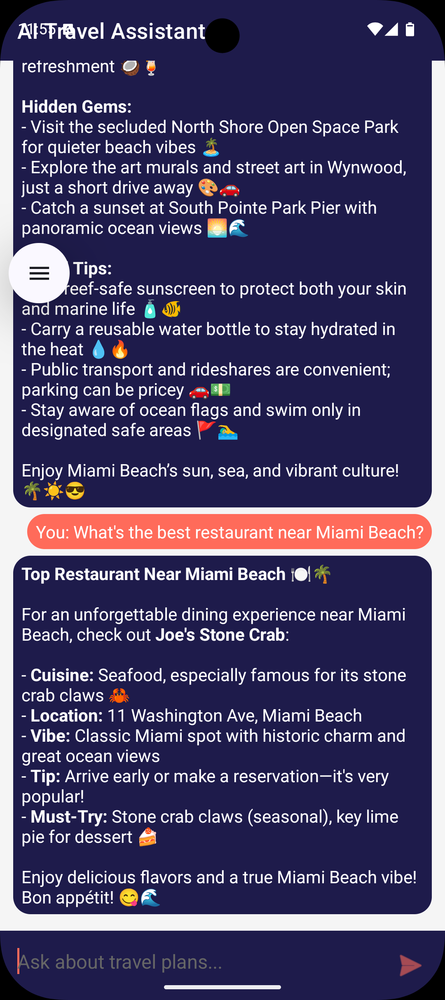

---

### 6. Map & Landmarks
Interactive map showing travel locations and landmark details.

  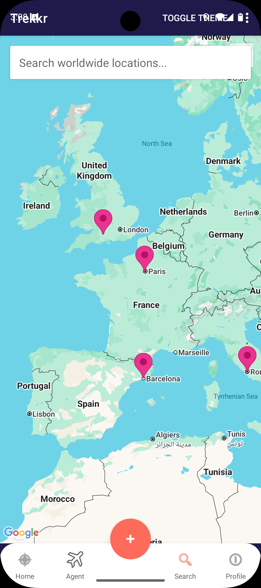
  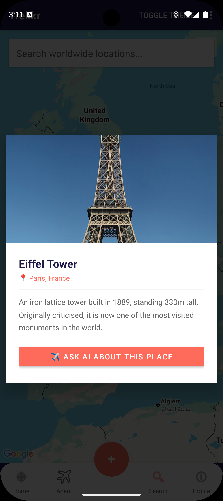

---

### 7. Landmark AI Assistant
Ask AI about landmarks for travel recommendations and information.

  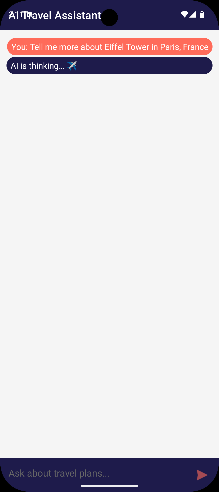

## Demo

*insert video demo here

Built as part of a Final Year Computer Science Project demonstrating mobile development, cloud integration, and AI-assisted user interaction.
**Note:** This is a beta version for testing purposes.
